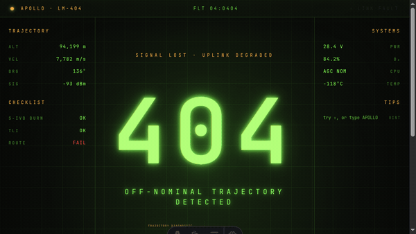
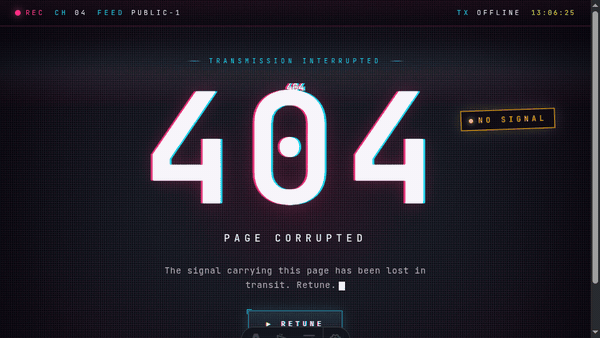
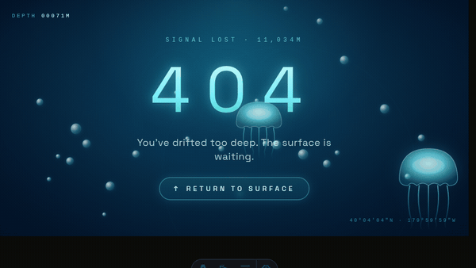
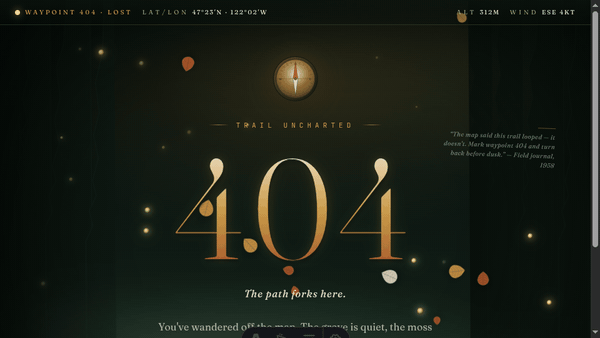

# 404-UI

<div align="center">

**Open-source animated 404 error pages for React, Vue, and vanilla JavaScript**

[](https://www.npmjs.com/package/@kripa006/404-ui)
[](https://www.npmjs.com/package/@kripa006/404-ui)
[](https://bundlephobia.com/package/@kripa006/404-ui)
[](#-features)
[](#-features)
[](https://github.com/kripa-sindhu-007/404_lib/blob/main/packages/404-ui/package.json#:~:text=size-limit)
[](https://opensource.org/licenses/MIT)
[](https://www.typescriptlang.org/)
[](https://opensource.org/licenses/MIT)
[](http://makeapullrequest.com)

[Documentation](https://kripa-sindhu-007.github.io/404_lib) · [Gallery](https://kripa-sindhu-007.github.io/404_lib/gallery) · [Live demos](#-gallery) · [Report Bug](https://github.com/kripa-sindhu-007/404_lib/issues) · [Request Feature](https://github.com/kripa-sindhu-007/404_lib/issues)

</div>

---

## 🖼️ Gallery

Four handcrafted templates, each shipping today for React, Vue, and Vanilla JS.

<table>
  <tr>
    <td align="center" width="25%">
      <a href="https://kripa-sindhu-007.github.io/404_lib/demo/space">
        
        <br />
        <strong>Space 404</strong>
      </a>
      <br />
      <sub>Mission-control console</sub>
    </td>
    <td align="center" width="25%">
      <a href="https://kripa-sindhu-007.github.io/404_lib/demo/glitch">
        
        <br />
        <strong>Glitch 404</strong>
      </a>
      <br />
      <sub>Corrupted broadcast</sub>
    </td>
    <td align="center" width="25%">
      <a href="https://kripa-sindhu-007.github.io/404_lib/demo/ocean">
        
        <br />
        <strong>Ocean 404</strong>
      </a>
      <br />
      <sub>Deep-sea drift</sub>
    </td>
    <td align="center" width="25%">
      <a href="https://kripa-sindhu-007.github.io/404_lib/demo/forest">
        
        <br />
        <strong>Forest 404</strong>
      </a>
      <br />
      <sub>Twilight rainforest</sub>
    </td>
  </tr>
</table>

## ✨ Features

- 🎨 **Four animated templates** — Space, Glitch, Ocean, Forest. All shipping today.
- ⚡ **Framework agnostic** — first-class React, Vue 3, and vanilla JS entry points with the same prop API.
- 🎯 **TypeScript first** — full type definitions for every component and prop.
- 📦 **Tree-shakable** — subpath imports per framework, only what you use lands in your bundle.
- 🌐 **SSR-safe** — no `window` / `document` access at module load. Works with Next.js, Nuxt, Astro, Remix.
- 🌈 **Tailwind powered** — built with Tailwind CSS for practical customization.
- ♿ **Accessible by default** — semantic headings, focusable controls, `prefers-reduced-motion` respected.
- 🌙 **Dark mode ready** — every template is tuned for polished dark-mode experiences.
- 🥚 **Easter eggs included** — each template hides a small ungated delight worth discovering.

## 🚀 How to Use in 3 Steps

### Step 1: Install the package

```bash
# npm
npm install @kripa006/404-ui

# pnpm
pnpm add @kripa006/404-ui

# yarn
yarn add @kripa006/404-ui
```

### Step 2: Import the styles once

```ts
import "@kripa006/404-ui/styles.css";
```

### Step 3: Drop a template into your 404 route

Pick a template below and copy the snippet for your framework.

## 🎨 Available Templates

All four templates ship today across React, Vue, and Vanilla. Pick a row, open the live demo, copy the snippet.

| Template       | Component / Factory             | Description                                                                  | Status                                                                 |
| -------------- | ------------------------------- | ---------------------------------------------------------------------------- | ---------------------------------------------------------------------- |
| **Space 404**  | `Space404` · `createSpace404`   | Apollo-era mission-control console with CRT phosphor, telemetry, easter eggs | ✅ [Live demo](https://kripa-sindhu-007.github.io/404_lib/demo/space)  |
| **Glitch 404** | `Glitch404` · `createGlitch404` | Corrupted broadcast feed — chromatic aberration, sync-bar tear, NO SIGNAL    | ✅ [Live demo](https://kripa-sindhu-007.github.io/404_lib/demo/glitch) |
| **Ocean 404**  | `Ocean404` · `createOcean404`   | Bioluminescent deep-sea drift with bubbles, jellyfish, sonar ping            | ✅ [Live demo](https://kripa-sindhu-007.github.io/404_lib/demo/ocean)  |
| **Forest 404** | `Forest404` · `createForest404` | Old-growth rainforest at twilight — drifting fog, fireflies, falling leaves  | ✅ [Live demo](https://kripa-sindhu-007.github.io/404_lib/demo/forest) |

## 🧩 Per-template snippets

Each template has the same prop shape across React, Vue, and Vanilla. Expand a template to see all three.

<details>
<summary><strong>Space 404</strong> — Apollo-era mission control</summary>

#### React

```tsx
import { Space404 } from "@kripa006/404-ui/react";

export default function NotFound() {
  return (
    <Space404
      title="404"
      eyebrow="SIGNAL LOST · UPLINK DEGRADED"
      headline="OFF-NOMINAL TRAJECTORY DETECTED"
      subtitle="The page you requested drifted outside the nominal envelope."
      buttonText="RE-VECTOR TO BASE"
      missionId="APOLLO · LM-404"
      onButtonClick={() => (window.location.href = "/")}
    />
  );
}
```

#### Vue

```vue
<script setup>
import { Space404 } from "@kripa006/404-ui/vue";
</script>

<template>
  <Space404
    title="404"
    eyebrow="SIGNAL LOST · UPLINK DEGRADED"
    headline="OFF-NOMINAL TRAJECTORY DETECTED"
    subtitle="The page you requested drifted outside the nominal envelope."
    button-text="RE-VECTOR TO BASE"
    mission-id="APOLLO · LM-404"
    @button-click="$router.push('/')"
  />
</template>
```

#### Vanilla JS

```js
import { createSpace404 } from "@kripa006/404-ui/vanilla";

const space404 = createSpace404(document.getElementById("app"), {
  title: "404",
  eyebrow: "SIGNAL LOST · UPLINK DEGRADED",
  headline: "OFF-NOMINAL TRAJECTORY DETECTED",
  subtitle: "The page you requested drifted outside the nominal envelope.",
  buttonText: "RE-VECTOR TO BASE",
  missionId: "APOLLO · LM-404",
  onButtonClick: () => (window.location.href = "/"),
});

// space404.destroy(); // call when unmounting
```

</details>

<details>
<summary><strong>Glitch 404</strong> — corrupted broadcast</summary>

#### React

```tsx
import { Glitch404 } from "@kripa006/404-ui/react";

export default function NotFound() {
  return (
    <Glitch404
      title="404"
      eyebrow="Transmission interrupted"
      headline="Page corrupted"
      subtitle="The signal carrying this page has been lost in transit."
      buttonText="Retune"
      channelId="04"
      onButtonClick={() => (window.location.href = "/")}
    />
  );
}
```

#### Vue

```vue
<script setup>
import { Glitch404 } from "@kripa006/404-ui/vue";
</script>

<template>
  <Glitch404
    title="404"
    eyebrow="Transmission interrupted"
    headline="Page corrupted"
    subtitle="The signal carrying this page has been lost in transit."
    button-text="Retune"
    channel-id="04"
    @button-click="$router.push('/')"
  />
</template>
```

#### Vanilla JS

```js
import { createGlitch404 } from "@kripa006/404-ui/vanilla";

const glitch404 = createGlitch404(document.getElementById("app"), {
  title: "404",
  eyebrow: "Transmission interrupted",
  headline: "Page corrupted",
  subtitle: "The signal carrying this page has been lost in transit.",
  buttonText: "Retune",
  channelId: "04",
  onButtonClick: () => (window.location.href = "/"),
});

// glitch404.destroy();
```

</details>

<details>
<summary><strong>Ocean 404</strong> — bioluminescent deep-sea drift</summary>

#### React

```tsx
import { Ocean404 } from "@kripa006/404-ui/react";

export default function NotFound() {
  return (
    <Ocean404
      title="404"
      eyebrow="Signal lost · 11,034m"
      subtitle="You've drifted too deep. The surface is waiting."
      buttonText="Return to surface"
      bubbleCount={28}
      onButtonClick={() => (window.location.href = "/")}
    />
  );
}
```

#### Vue

```vue
<script setup>
import { Ocean404 } from "@kripa006/404-ui/vue";
</script>

<template>
  <Ocean404
    title="404"
    eyebrow="Signal lost · 11,034m"
    subtitle="You've drifted too deep. The surface is waiting."
    button-text="Return to surface"
    :bubble-count="28"
    @button-click="$router.push('/')"
  />
</template>
```

#### Vanilla JS

```js
import { createOcean404 } from "@kripa006/404-ui/vanilla";

const ocean404 = createOcean404(document.getElementById("app"), {
  title: "404",
  eyebrow: "Signal lost · 11,034m",
  subtitle: "You've drifted too deep. The surface is waiting.",
  buttonText: "Return to surface",
  bubbleCount: 28,
  onButtonClick: () => (window.location.href = "/"),
});

// ocean404.destroy();
```

</details>

<details>
<summary><strong>Forest 404</strong> — old-growth rainforest at twilight</summary>

#### React

```tsx
import { Forest404 } from "@kripa006/404-ui/react";

export default function NotFound() {
  return (
    <Forest404
      title="404"
      eyebrow="Trail uncharted"
      headline="The path forks here."
      subtitle="You've wandered off the map. The grove is quiet — find your bearings and head back."
      buttonText="Find your bearings"
      coordinates="47°23′N · 122°02′W"
      onButtonClick={() => (window.location.href = "/")}
    />
  );
}
```

#### Vue

```vue
<script setup>
import { Forest404 } from "@kripa006/404-ui/vue";
</script>

<template>
  <Forest404
    title="404"
    eyebrow="Trail uncharted"
    headline="The path forks here."
    subtitle="You've wandered off the map. The grove is quiet — find your bearings and head back."
    button-text="Find your bearings"
    coordinates="47°23′N · 122°02′W"
    @button-click="$router.push('/')"
  />
</template>
```

#### Vanilla JS

```js
import { createForest404 } from "@kripa006/404-ui/vanilla";

const forest404 = createForest404(document.getElementById("app"), {
  title: "404",
  eyebrow: "Trail uncharted",
  headline: "The path forks here.",
  subtitle:
    "You've wandered off the map. The grove is quiet — find your bearings and head back.",
  buttonText: "Find your bearings",
  coordinates: "47°23′N · 122°02′W",
  onButtonClick: () => (window.location.href = "/"),
});

// forest404.destroy();
```

</details>

## 🎨 Theming

404-UI ships its design tokens as a Tailwind preset on the `./theme` subpath, and every template forwards `style` and `className` to its root element so you can override animation timing and tunable CSS variables per instance.

### Tailwind preset

```ts
// tailwind.config.ts
import { fourZeroFourPreset } from "@kripa006/404-ui/theme";

export default {
  presets: [fourZeroFourPreset],
  content: ["./src/**/*.{js,ts,jsx,tsx,vue,astro}"],
};
```

The preset exposes:

- `spaceColors` — palette tokens grouped under `space.*`, `ocean.*`, and `forest.*` (e.g. `space.phosphor`, `space.hull`, `ocean.accent`, `ocean.glow`, `forest.moss`, `forest.ember`, `forest.parchment`).
- `animationKeyframes` + `animationUtilities` — keyframes and `animation-*` utilities (e.g. `animate-scan`, `animate-rise`, `animate-firefly-pulse`).
- `spaceFontFamily` — `font-space`, `font-telemetry` (mono), and `font-grove` (serif) stacks.
- `fourZeroFourPreset` — the assembled `Partial<Config>` (also the default export).

Import the raw groups directly if you prefer to compose your own preset:

```ts
import { spaceColors, animationUtilities } from "@kripa006/404-ui/theme";
```

### CSS variable overrides

Each template’s root container forwards an inline `style` prop, so you can tweak the tunable variables it consumes without forking any CSS:

| Template  | CSS variables                                                                                                                                                                              |
| --------- | ------------------------------------------------------------------------------------------------------------------------------------------------------------------------------------------ |
| Space404  | `--orbit-duration`, `--rocket-x`                                                                                                                                                           |
| Ocean404  | `--bubble-x`, `--bubble-size`, `--bubble-duration`, `--bubble-delay`, `--bubble-drift`, `--jelly-x`, `--jelly-y`, `--jelly-size`, `--jelly-duration`, `--jelly-delay`                      |
| Forest404 | `--ff-x`, `--ff-y`, `--ff-size`, `--ff-duration`, `--ff-delay`, `--ff-drift-x`, `--ff-drift-y`, `--leaf-x`, `--leaf-size`, `--leaf-tint`, `--leaf-duration`, `--leaf-drift`, `--leaf-spin` |
| Glitch404 | inherits container tokens from the Tailwind preset (no per-instance variables)                                                                                                             |

```tsx
// Slow the orbital ring + warm the falling leaves on a per-instance basis.
<Space404 style={{ "--orbit-duration": "60s" } as React.CSSProperties} />

<Forest404 style={{ "--leaf-tint": "#b85a2c" } as React.CSSProperties} />
```

For deeper palette swaps, override the Tailwind tokens at build time via the preset, or wrap a template in a parent rule:

```css
.brand-space-404 .space-404-container {
  background-color: #1a0033;
  color: #ff00aa;
}
```

See [`packages/404-ui/src/theme.ts`](packages/404-ui/src/theme.ts) for the canonical token list and the [Theming guide](https://kripa-sindhu-007.github.io/404_lib/theming) on the docs site for live examples.

## 📖 API Reference

Every template accepts the shared base props (`title`, `subtitle`, `buttonText`, `onButtonClick`, `className`) plus its own theme-specific props (e.g. `missionId`, `channelId`, `bubbleCount`, `coordinates`).

For the full prop tables, theme tokens, and the per-template easter-egg notes, see the [documentation site](https://kripa-sindhu-007.github.io/404_lib).

## 🛠️ Development

```bash
# Clone the repository
git clone https://github.com/kripa-sindhu-007/404_lib.git
cd 404_lib

# Install dependencies
pnpm install

# Start development
pnpm dev

# Build all packages
pnpm build

# Run linting
pnpm lint

# Run type checking
pnpm typecheck
```

## 📁 Project Structure

```
404_lib/
├── packages/
│   └── 404-ui/           # Main library (React + Vue + Vanilla)
│       ├── src/
│       │   ├── core/     # Framework-agnostic utilities + assets
│       │   ├── react/    # React components (Space, Glitch, Ocean, Forest)
│       │   ├── vue/      # Vue 3 components
│       │   ├── vanilla/  # Vanilla JS factories
│       │   └── theme.ts  # Exported design tokens
│       └── package.json
├── apps/
│   └── docs/             # Documentation site (Astro)
├── .github/
│   └── workflows/        # CI/CD pipelines
└── package.json          # Root workspace
```

## 🤝 Contributing

Contributions are welcome! Please read our [Contributing Guide](CONTRIBUTING.md) for details.

1. Fork the repository
2. Create your feature branch (`git checkout -b feature/amazing-feature`)
3. Commit your changes (`git commit -m 'feat: add amazing feature'`)
4. Push to the branch (`git push origin feature/amazing-feature`)
5. Open a Pull Request

Please also review the [Code of Conduct](CODE_OF_CONDUCT.md) and [Security Policy](SECURITY.md) before opening community or security-related reports.

## 📄 License

This project is licensed under the MIT License - see the [LICENSE](LICENSE) file for details.

## 🙏 Acknowledgments

- Built with [Tailwind CSS](https://tailwindcss.com/)
- Bundled with [tsup](https://tsup.egoist.dev/)
- Documentation powered by [Astro](https://astro.build/)
- Monorepo managed by [Turborepo](https://turbo.build/)

---

<div align="center">
  Made with ❤️ by <a href="https://github.com/kripa-sindhu-007">Kripa Sindhu</a>
</div>
